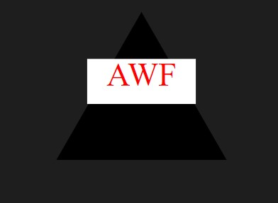

# LogoMakerSVG

## Description

Using Node.js a series of prompts will ask you for up to three characters for your logo it will use the answers from the prompts to generate a logo and make a logo.svg file. 

## Table of Contents

- [Usage](#usage)
- [Video](#video)
- [Images](#images)
- [Questions](#questions)

## Usage

Using your terminal enter node index.js after that a series of promts will ask for information and use that information to make a logo .svg file. 

## Video
To see a video demonstrating how to use the logo generator please 
[Click here](https://drive.google.com/file/d/1-f3i898OXnkzMYFUV2iX7oY1Dti2zA8j/view)

## Images

This is a screen shot example of my code for the logo generator 

This is a example of one of logos I made using the logo generator 

## Questions

For questions, please contact:

- Email: fanger_austin@yahoo.com
- GitHub: github.com/Afang911